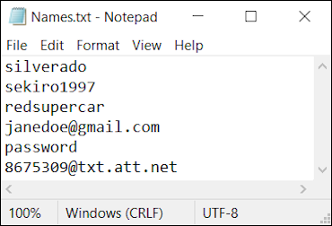
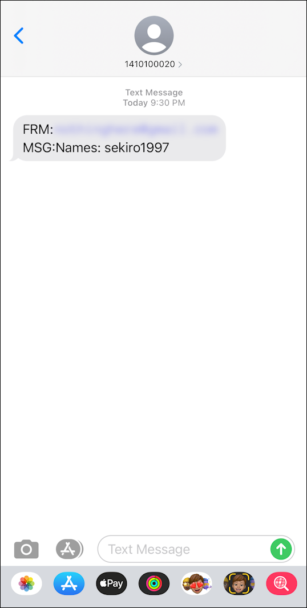

# NameMC Text Alerts

## Synopsis:
This Python script repeatedly scrapes [NameMC](https://namemc.com/) on a set duration to check the availability of Minecraft usernames.  
Any available usernames are then texted to a specific phone number.

## Requirements:
* [Python 3.0+](https://www.python.org/)
* [Requests Library](https://requests.readthedocs.io/en/master/) - *pip install requests*
* [Beautiful Soup Library](https://www.crummy.com/software/BeautifulSoup/bs4/doc/) - *pip install beautifulsoup4*
* [2-step Gmail Verification](https://www.google.com/landing/2step/)

## Usage:
* Update your Names.txt file
  * Put one username per line
  * 3rd to last line: your gmail
  * 2nd to last line: your gmail 2-factor verification code
  * last line: insert an [SMS gateway email](https://20somethingfinance.com/how-to-send-text-messages-sms-via-email-for-free/) to text your phone
* python NameScraper.py (*optional minute delay*)

## Example:
  

## Support:
* Windows :heavy_check_mark:
* Linux: :heavy_check_mark:
* Mac: :heavy_check_mark:
